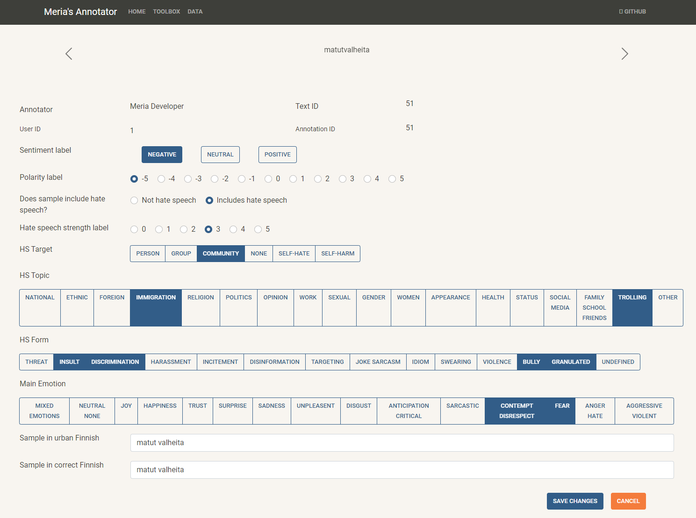
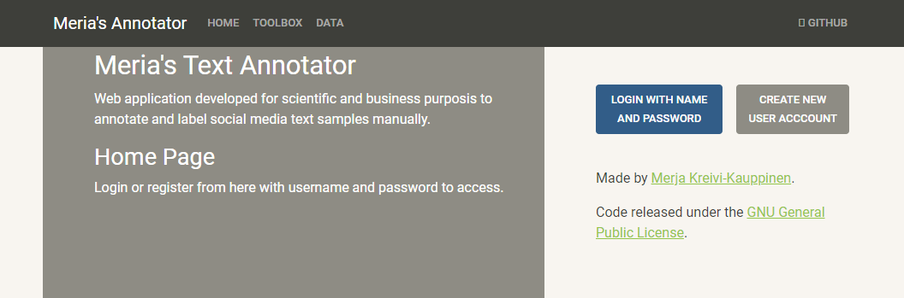
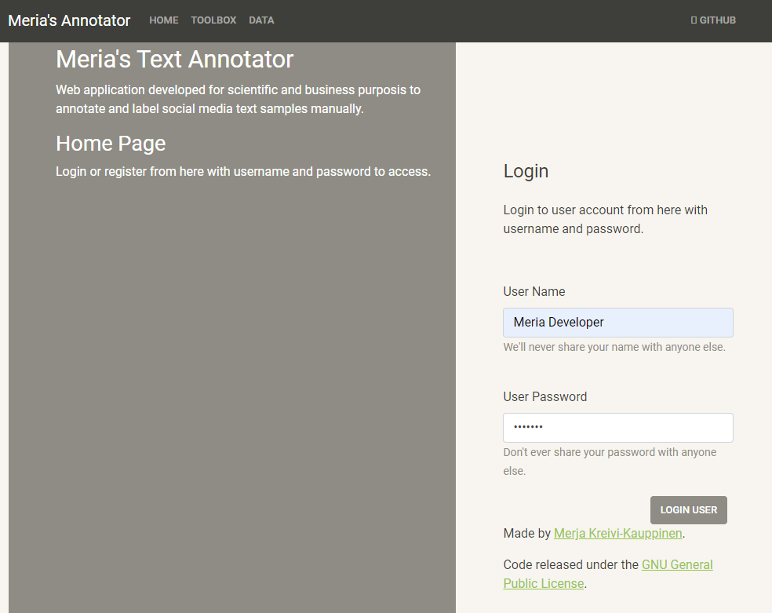
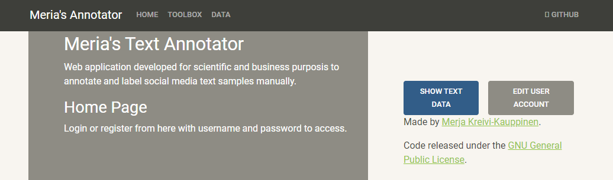
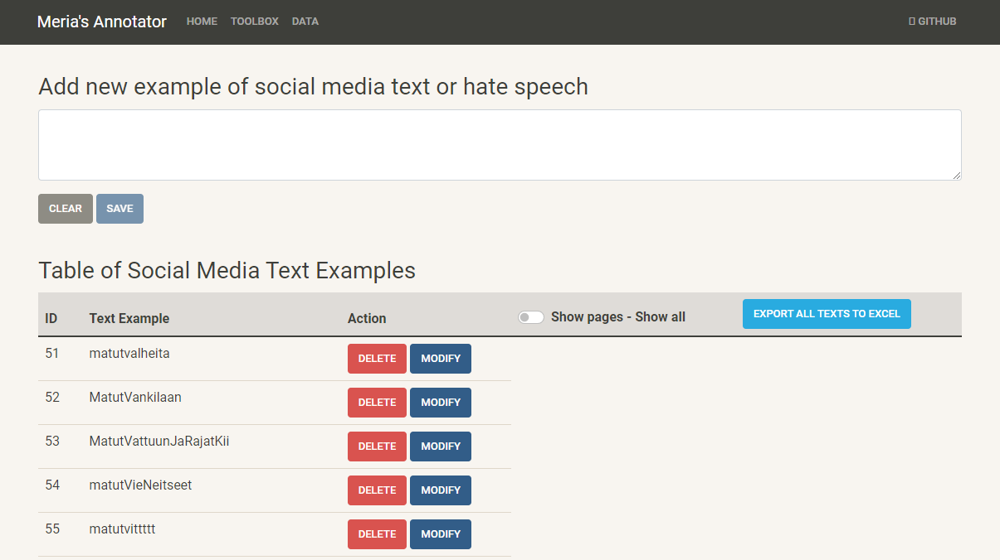
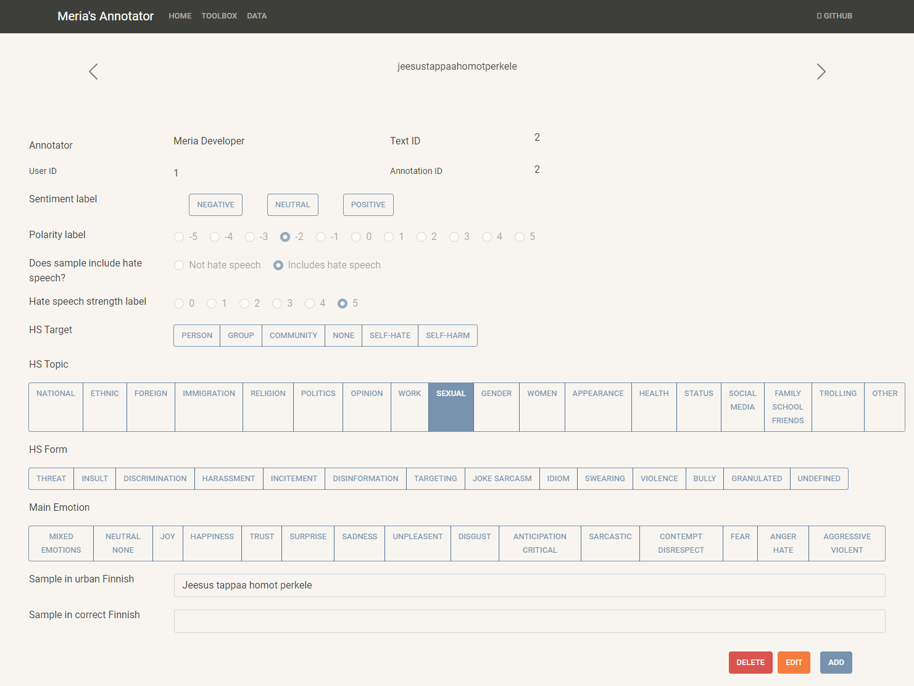
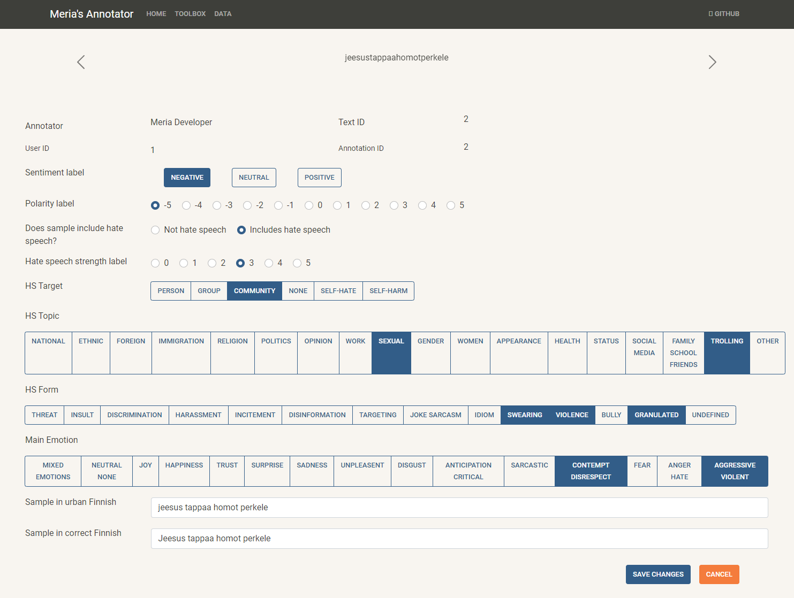
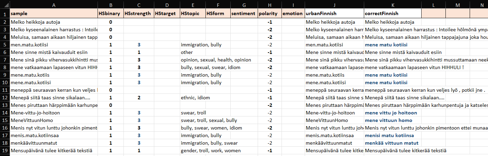
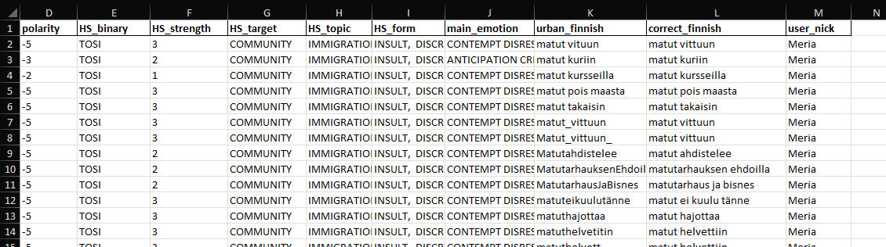

# Meria's Social Media Text Annotator Web API

## INTRODUCTION

Meria's 'Social Media Text Annotator' for social media text samples was created by Merja Kreivi-Kauppinen (2021-2022) at University of Oulu as a part of scientific work of my Master’s thesis. 

The design of 'Social Media Text Annotator' was implemented on basis of 'HS Annotation Framework' to smooth and facilitate manual labeling process of sentiment and hate speech (HS) annotation of Finnish social media text samples.

The technical design and development of 'Social Media Text Annotator' was implemented on the basis of 'HS Annotation Framework' reported on Master’s Thesis research paper - 
Merja Kreivi-Kauppinen (2024) Signs of Paradigm Shift in Hate Speech Detection Methodology: Hate Speech Detection of Dialectal, Granular and Urban Finnish. University of Oulu, Degree Programme in Computer Science and Engineering. Master’s Thesis, 111 p.

Meria's Annotator includes small GUI for the Social-Media-Text-Annotator API. The 'Social Media Text Annotator' was conducted mainly on python coding language with Restful Web SPA, Flask RESTful, Flask SQLAlchemy, SQLite, jQuery, Vanilla JavaScript, CSS Bootstrap and HTML methodologies. Working process included designing, coding, debugging, and testing phases of the Web API. 

The designed 'Social Media Text Annotator' presents schematic structure of hate speech (HS) categories and subcategories for manual labeling process of Finnish social media data. With help of the Social-Media-Text-Annotator API client you can import social media text samples into database, manually label saved text samples, and keep all samples and annotations available in the database. 
API and database create an environment for multiple users.

## HATE SPEECH (HS) ANNOTATION FRAMEWORK 

The 'HS Annotation Framework' is presented shortly in 'readme_Hate_Speech_Annotation_Framework' -file.

Hate Speech Annotation Framework and Social-Media-Text-Annotator Web API are under construction and development work, and therefore published application includes unfinished and undefined categories and subcategories. 

## INSTALL, SET UP VENV, and RUN

The instructions how to install, set up virtual environment, run, and quit API is presented shortly in 'readme_How_to_install_and_run' -file.

## LICENSE

The code of this project is released under the GNU General Public Licence.

## HOW TO USE Social-Media-Text-Annotator API

### Home page

API lands on home page.

### Login page

Login at login page with .....

### Toolbox page

At toolbox page user can choose to proceed to dataset page.

### Dataset page

Check, add data, and get output of data on dataset page.

### Landing on carousel page

From dataset page user lands on the starting page of carousel pages.

### Manual labeling on carousel page

Manual labeling of samples is carried on carousel pages.

## DATA

Data of the research work was not published.

### Input data

Input data (as social media text samples) is read from excel -file.
Excel -file must be located at data -folder, and it must be defined at models.py -file.
In addition, it should be defined how many rows (as samples) is read to database.

Data table must include following columns (in the same exact order):

### Output of labeling results

The results of manual labeling process can be print out at dataset -page 
by clicking 'EXPORT ALL TEXT TO EXCEL' -tab.

The ouput of database is print out in excel -format.

