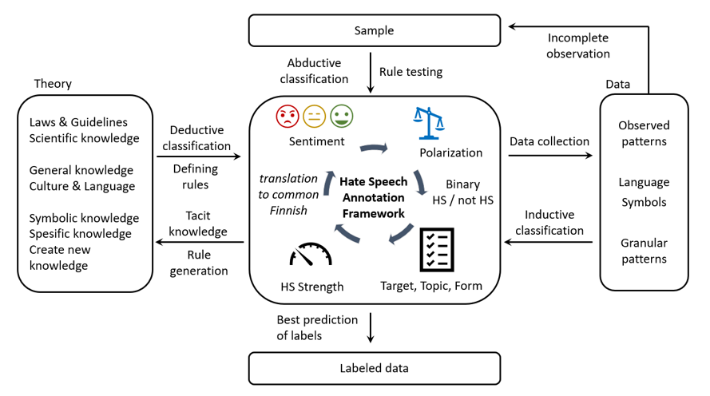
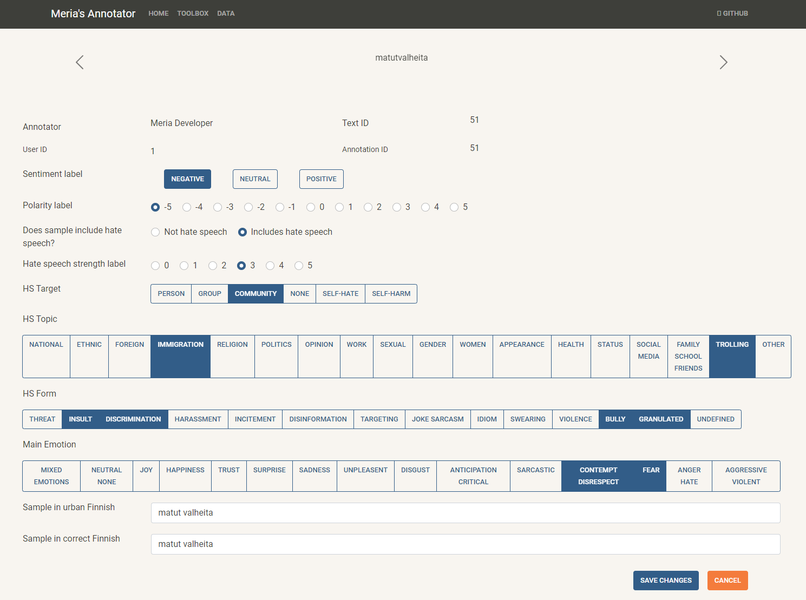
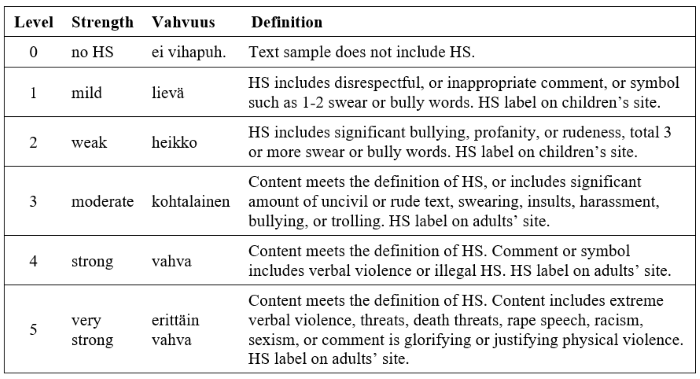
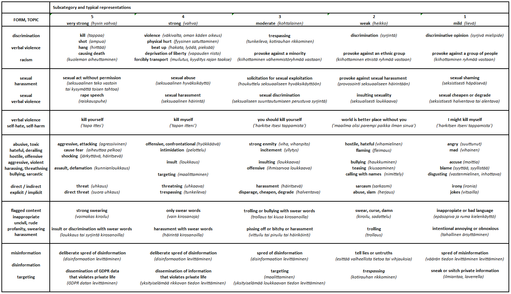

# Hate Speech Annotation Framework

## INTRODUCTION 

The design and development of 'Hate Speech Annotation Framework' (HS Annotation Framework) 
is based on the research work reported on (Master’s Thesis) research paper - 

Merja Kreivi-Kauppinen (2024) Signs of Paradigm Shift in Hate Speech Detection Methodology: Hate Speech Detection of Dialectal, Granular and Urban Finnish. University of Oulu, Degree Programme in Computer Science and Engineering. Master’s Thesis, 111 p.

## DESIGN AND DEVELOPMENT of 'HS Annotation Framework' 

The design of ‘HS Annotation Framework’ collected theoretical knowledge and empirical findings 
on structural system aimed to facilitate and speed up manual labeling tasks of data collection process. The categories and subcategories of ‘HS Annotation Framework’ are based on research and literature findings. The figure below presents an iterative data design and generation process performed with 'HS Annotation Framework'.

Figure. Iterative data generation process with HS Annotation Framework.

## HATE SPEECH (HS) ANNOTATION FRAMEWORK 

The ‘HS Annotation Framework’ includes seven (7) main categories for the content of sample, and 28 separate conceptual subcategories. Subcategories are used as the basis for the label entries, and their explanations define label boundaries. The classification categories, subcategories, and their justifications follow the requirements of Finnish legislation as well as the norms and behavior generally accepted in Finnish culture and social media. 

Figure. Manual labeling page provides access to all labels of HS Annotation Framework.

### Text carousel

Text carousel provides the original 'raw' social media text sample. Sample is presented as given (or savad) without any cleaning or modification.

Annotation framework and Web API is designed for Finnish samples only. Text samples and content containing other languages than Finnish can be discarded from the data during the annotation process. 

### Sentiment (trinary) 
On ‘sentiment’ category every (social media (SM) text) sample in data is labeled into ‘negative’, ‘positive’, or‘neutral’ subcategory . 

### Polarity 
On sentiment polarization category ‘polarity’ is used for manual labeling of an estimate of overall polarity level into one of eleven (11) polarity subcategory between -5 and 5. The ‘polarity’ subcategories are: 

<li>   '-5', '-4', '-3', '-2', '-1', '0', '1', '2', '3', '4', and '5'

### HSbinary 
On binary hate speech category ‘HSbinary’ sample in data is labeled into one of two HS subcategories: 
<li>   Not hate speech (noHS)
<li>   Includes hate speech (HS)

### HSstrength 
Hate speech strength category ‘HSstrength’ labels dimension of HS according to rising hate levels: 
<li>    0, 1, 2, 3, 4, and 5, 

where subcategories provide an estimate of how hateful, hostile, violent, aggressive, harassing, harmful, abusive, and/or intentional a sample content is. 

Table. Subcategories of hate speech strength level in ‘HSstrength’ category.

Table. Subcategories and typical representations of HSstrength category.

### HStarget 
Hate speech target category ‘HStarget’ is used to label the target, object, or victim of the HS into one of five subcategories, where subcategories are: 
<li>   person, (small) 'group', (large) 'community', 'self-hate', 'self-harm', and 'none'

In ‘none’-subcategory the target of HS is not mentioned, or HS is presented as trolling, where clear target does not exist. 

### HStopic 
Hate speech topic category ‘HStopic’ is used to label sample content into one or several topic subcategories (18 different topic subcategories), where subcategories are: 

<li>   national, ethnic, foreign, immigration, religion, politics, opinion, work, sexual, gender, women, appearance, health, status, social media, family (school, friends), trolling, and other

The 'other' subcategory is available for complex cases to smooth manual labeling process.

### HSform 
Hate speech form category ‘HSform’ is used to label sample content into one or several form, type, or style describing subcategories. HS form category identifies 14 different subcategories including 

<li>   threat, insult, discrimination, harassment, incitement, disinformation, targeting, sarcasm, idiom, swearing, violence, bully, granulated, and undefined

The 'undefined' (or something else) subcategory is available for complex cases to smooth manual labeling process.

### Sample in urban Finnish

Words and symbols written together (as granulated or coded text) on an original unprocessed ‘raw’ text sample were separated by a space.

### Sample in correct Finnish

Words and text including typos, or intentionally incorrectely written text (as granulated or coded text) on an original unprocessed ‘raw’ text sample were manually processed into more ‘correct’ text format. Therefore on manually processed ‘correct’ text samples typos and granulated samples were changed into more correct form grammatically.

### Undefined and unfinished categories and subcategories (like 'Main Emotion' category)

Web API of HS Annotation Framework is under construction and development work, 
and therefore the published application includes unfinished and undefined categories and subcategories. 
